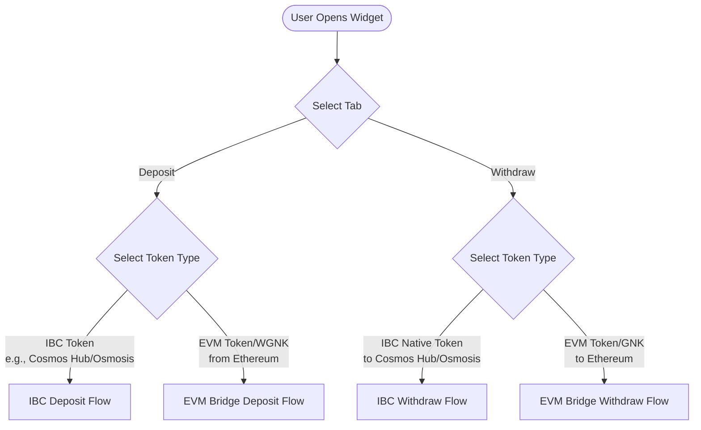
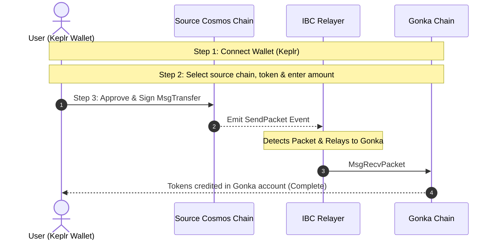
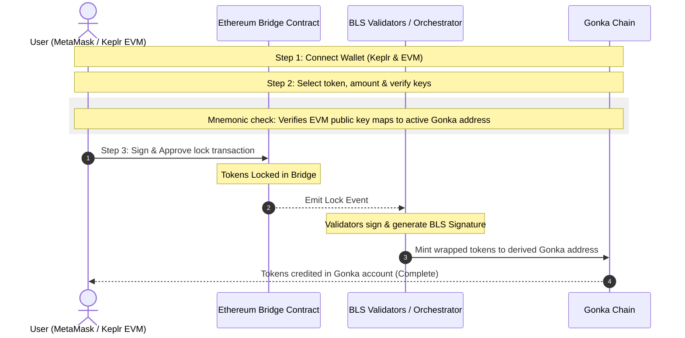
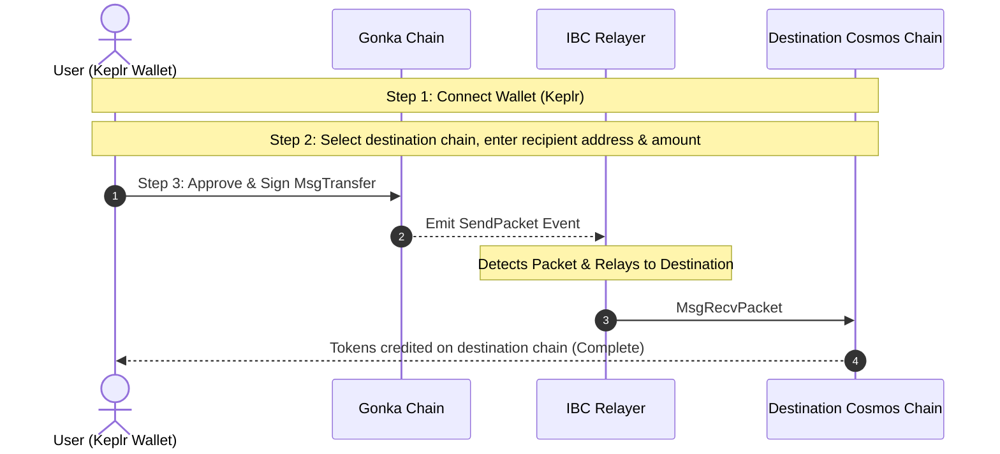
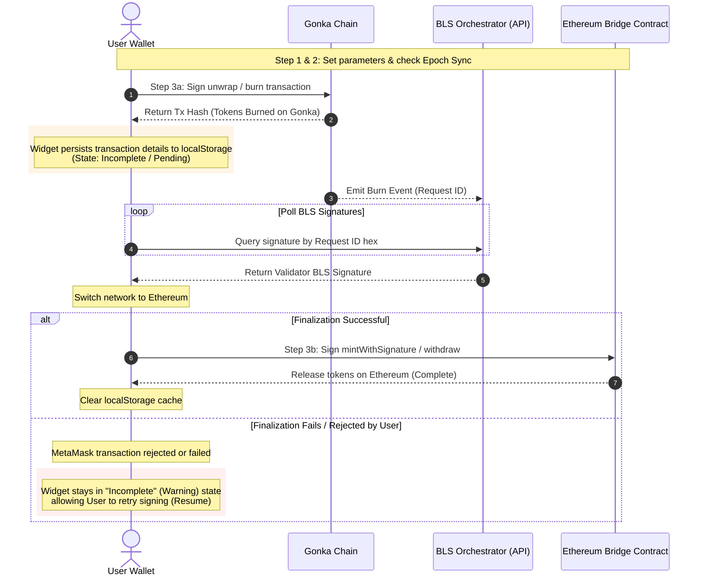
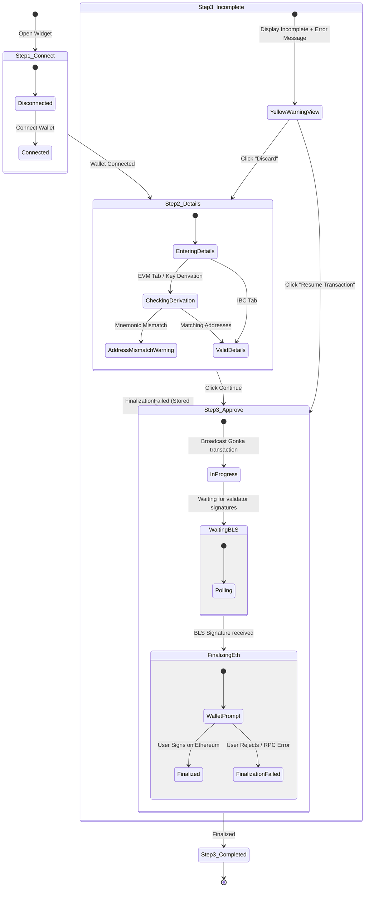

# Exchange & Bridge Widget User Flows & State Machine

This document outlines all the user flows, transaction states, and recovery behaviors for the Exchange & Bridge Widget.

---

## 1. High-Level Flow Selector

---

## 2. Detailed Transaction Flows

### A. Deposit Flows

#### IBC Deposit Flow (Cosmos Hub / Osmosis $\rightarrow$ Gonka)

#### EVM Bridge Deposit Flow (Ethereum $\rightarrow$ Gonka)

---

### B. Withdrawal Flows

#### IBC Withdrawal Flow (Gonka $\rightarrow$ Cosmos Hub / Osmosis)

#### EVM Bridge Withdrawal Flow (Gonka $\rightarrow$ Ethereum)
This flow features a **two-step cross-chain transaction** with persistent state recovery.

---

## 3. Widget Step & State Machine

